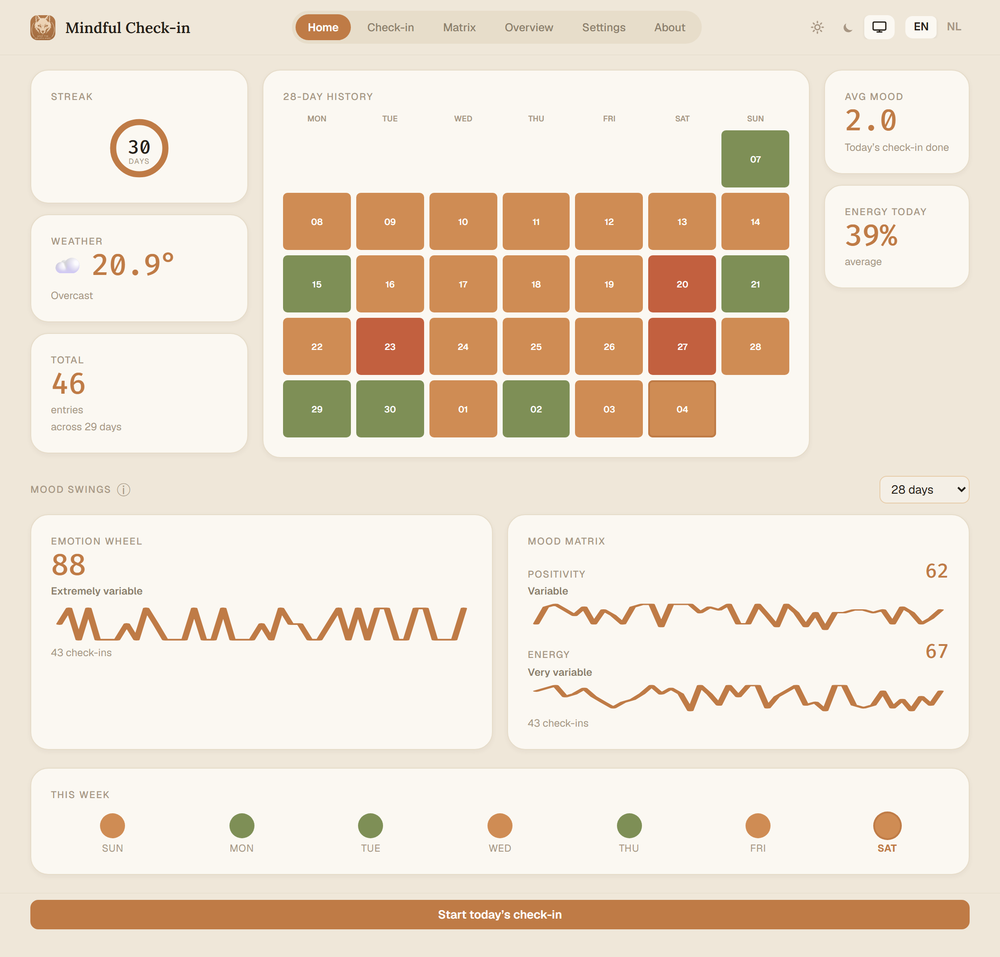
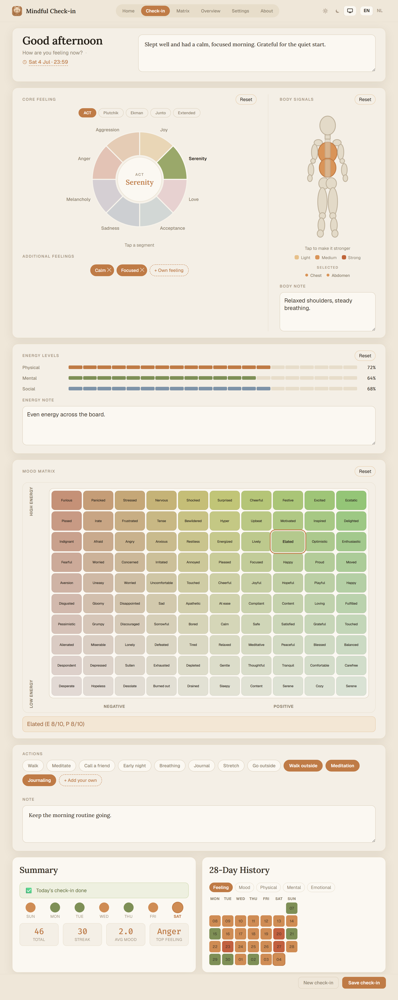
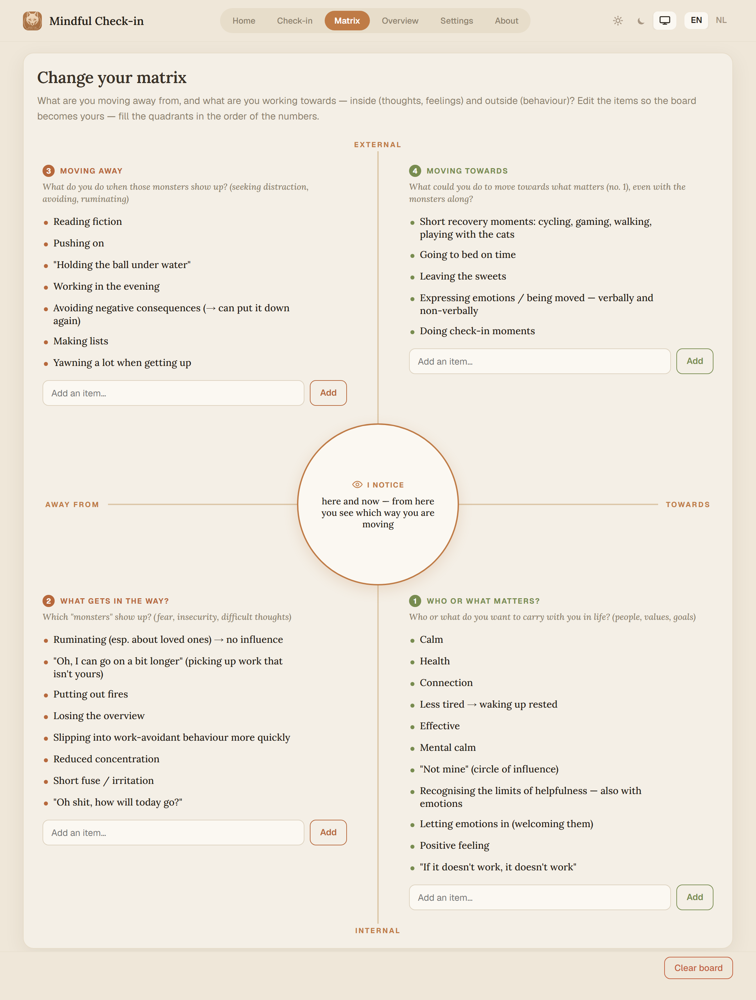
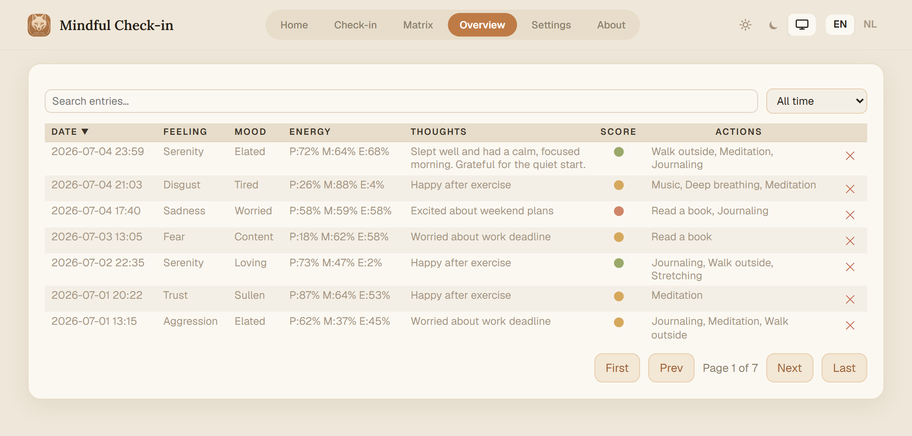
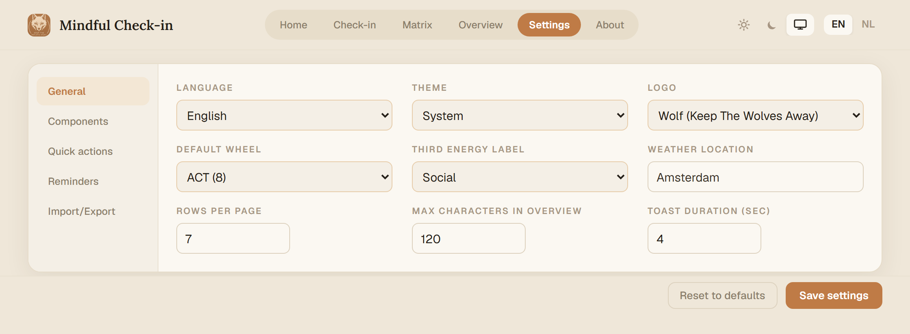

# Mindful Check-in

**A calm, private space to check in with yourself.** Track how you feel across the day — your emotions, your body, your energy and mood — and watch the patterns emerge over time. Everything runs in your browser and stays on your device. No account, no server, no tracking.

---

## Get it running

No install, no sign-up. Grab the latest [**Release**](../../releases/latest) and open it:

- **`mindful-check-in.html`** — the whole app in a single file. Download it, double-click, done. It runs offline and keeps your data on your own device.
- **`mindful-check-in-dist.zip`** — the same app as a small folder; unzip and open `index.html`.

> Everything works straight from the downloaded file — including the weather widget. The only exception is **reminders** (browser notifications), which need the app opened from a web address rather than a local file.

---

## What you can do

### Check in with yourself

A check-in is a snapshot of how you're doing right now. Fill in as much or as little as you like — every part is optional, and you can hide the parts you don't use.

- **Thoughts** — a free space for whatever is on your mind.
- **Core feeling** — pick one primary emotion from an interactive wheel. Choose the model that speaks to you: **ACT**, **Plutchik**, **Ekman**, **Junto**, or an **Extended** 12-emotion wheel.
- **Body signals** — tap where you notice something on a body figure, and tap again to mark how strong it feels.
- **Energy** — set your Physical, Mental, and Emotional/Social levels.
- **Mood matrix** — place yourself on a 10×10 grid of 100 mood words, from calm to energised and negative to positive.
- **Actions & notes** — jot down what you did or plan to do, plus any extra note.

Save updates today's check-in, or start a fresh one whenever your state shifts — you can log more than once a day.

### See your patterns

The home dashboard gives you the bigger picture at a glance: your current **streak**, a **28-day history** heatmap, today's weather and energy, and **mood-swing** trends that show how much you've been fluctuating.

### Work with the change matrix

An ACT-inspired board for reflecting on where you're headed — what you want to move *away from* and *towards*, both inside (thoughts, feelings) and outside (behaviour). The centre keeps you anchored in the here and now.

### Browse your history

Every check-in in one searchable, sortable table. Filter by date, search your notes, and export a single entry or your whole history as a file you can back up or move to another device.

### Make it yours

- Switch between **English** and **Dutch** anytime.
- Choose **light, dark, or system** theme.
- Pick your default emotion wheel, set your weather location, and tune the overview table.
- **Hide any check-in section** you don't want to see.
- Set up **quick-action chips** for the things you do most.
- **Export and import** your data and settings as plain files.

Curious first? The **About → Data** tab can generate a month of demo entries so you can explore everything with the views already filled in — and clear it all with one button.

---

## Your privacy

- **It's yours, and it stays yours.** Everything is saved locally in your browser. There is no backend and no account.
- **No tracking.** No cookies, no analytics, nobody watching.
- **No network requests** — except the optional weather widget, which only sends a location to fetch the current conditions ([Open-Meteo](https://open-meteo.com/), free, no personal data). Turn the weather component off in Settings for a fully offline experience.
- Your data is stored as plain text in the browser and isn't encrypted, so treat the device as you would a private notebook.

---

## Reminders

Mindful Check-in can nudge you with a browser notification at intervals you choose (**Settings → Reminders**). Because notifications need a secure context, reminders only work when the app is opened from a web address, not straight from a downloaded file. Everything else works either way.

---

## For developers

This is a from-scratch TypeScript + Vite app with no UI framework. Build steps, project layout, data format, and the testing setup live in **[docs/development.md](docs/development.md)**, with the full technical reference in **[docs/architecture.md](docs/architecture.md)**.

---

## License

Released under the [MIT License](https://opensource.org/licenses/MIT) — free to use, modify, and share, with attribution to the original source.

Copyright (c) 2026 [somali-lab](https://github.com/somali-lab)
